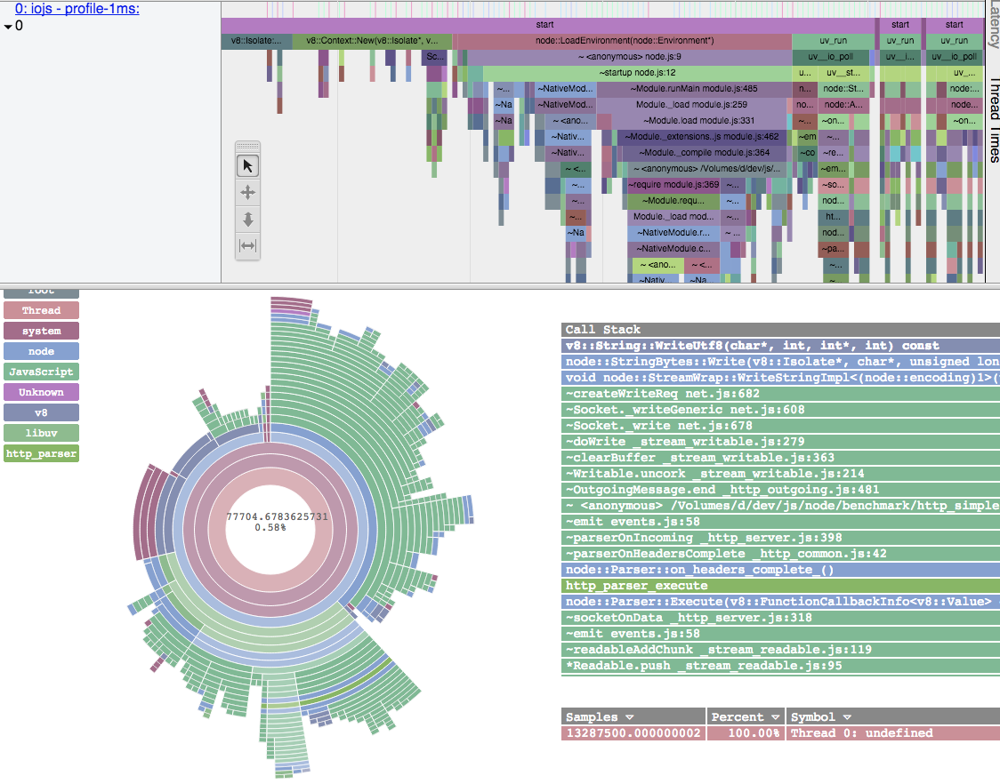
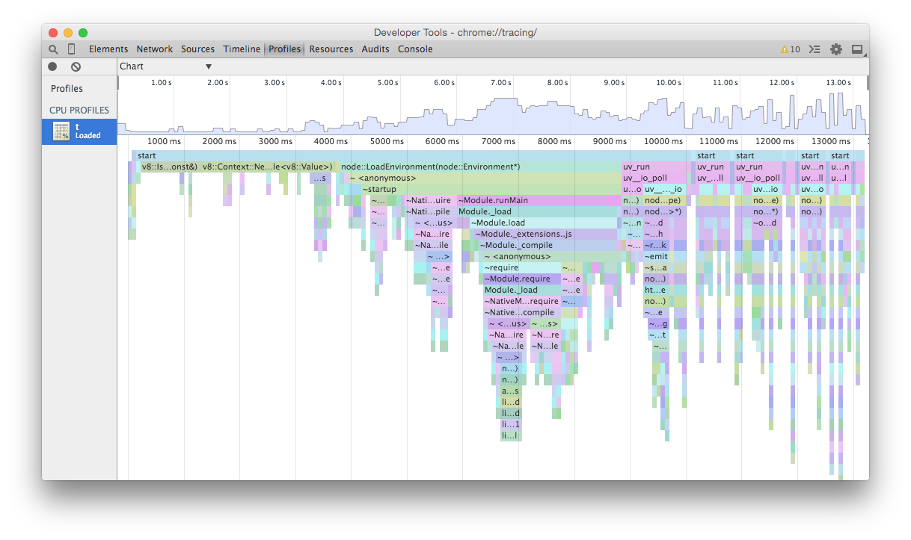

# traceviewify [](http://travis-ci.org/thlorenz/traceviewify)

[](https://ci.testling.com/thlorenz/traceviewify)

Converts `.cpuprofile` format to trace viewer [JSON object
format](https://docs.google.com/document/d/1CvAClvFfyA5R-PhYUmn5OOQtYMH4h6I0nSsKchNAySU/edit#heading=h.q8di1j2nawlp) to allow analysing the data in chrome://tracing.

```js
var traceviewify = require('traceviewify');
var cpuprofile = require('./fixtures/fibonacci.cpuprofile');

var traceviewObjectFormat = traceviewify(cpuprofile); 
```

## Screenshots



*The screenshot above shows [chrome://tracing](chrome://tracing) timeline and sunburst of traceviewified data*



*The screenshot above shows DevTools with `.cpuprofile` from which the traceview was generated*

## Usage

```
cat some.cpuprofile | traceviewify > trace.json
```

Then load it into [chrome://tracing](chrome://tracing).

## Installation

    npm install traceviewify

## DTrace

A [simple DTrace script](https://github.com/thlorenz/traceviewify/blob/master/tools/trace_entry_return.d) was also added
which generates trace viewer events. The resulting JSON can be directly imported into
[chrome://tracing](chrome://tracing).

## API


<!-- START docme generated API please keep comment here to allow auto update -->
<!-- DON'T EDIT THIS SECTION, INSTEAD RE-RUN docme TO UPDATE -->

<div>
<div class="jsdoc-githubify">
<section>
<article>
<div class="container-overview">
<dl class="details">
</dl>
</div>
<dl>
<dt>
<h4 class="name" id="traceviewify"><span class="type-signature"></span>traceviewify<span class="signature">(cpuprofile, <span class="optional">opts</span>)</span><span class="type-signature"> &rarr; {Object}</span></h4>
</dt>
<dd>
<div class="description">
<p>Converts given cpuprofile object to a trace viewer JSON object.</p>
</div>
<h5>Parameters:</h5>
<table class="params">
<thead>
<tr>
<th>Name</th>
<th>Type</th>
<th>Argument</th>
<th class="last">Description</th>
</tr>
</thead>
<tbody>
<tr>
<td class="name"><code>cpuprofile</code></td>
<td class="type">
<span class="param-type">Object</span>
</td>
<td class="attributes">
</td>
<td class="description last"><p>as produced by Chrome DevTools or <a href="https://github.com/thlorenz/cpuprofilify">cpuprofilify</a></p></td>
</tr>
<tr>
<td class="name"><code>opts</code></td>
<td class="type">
<span class="param-type">Object</span>
</td>
<td class="attributes">
&lt;optional><br>
</td>
<td class="description last">
<h6>Properties</h6>
<table class="params">
<thead>
<tr>
<th>Name</th>
<th>Type</th>
<th class="last">Description</th>
</tr>
</thead>
<tbody>
<tr>
<td class="name"><code>pid</code></td>
<td class="type">
<span class="param-type">number</span>
</td>
<td class="description last"><p>sets process id</p></td>
</tr>
<tr>
<td class="name"><code>tid</code></td>
<td class="type">
<span class="param-type">number</span>
</td>
<td class="description last"><p>sets thread id</p></td>
</tr>
<tr>
<td class="name"><code>cpu</code></td>
<td class="type">
<span class="param-type">number</span>
</td>
<td class="description last"><p>sets CPU number</p></td>
</tr>
</tbody>
</table>
</td>
</tr>
</tbody>
</table>
<dl class="details">
<dt class="tag-source">Source:</dt>
<dd class="tag-source"><ul class="dummy">
<li>
<a href="https://github.com/thlorenz/traceviewify/blob/master/index.js">index.js</a>
<span>, </span>
<a href="https://github.com/thlorenz/traceviewify/blob/master/index.js#L12">lineno 12</a>
</li>
</ul></dd>
</dl>
<h5>Returns:</h5>
<div class="param-desc">
<p>trace viewer JSON object</p>
</div>
<dl>
<dt>
Type
</dt>
<dd>
<span class="param-type">Object</span>
</dd>
</dl>
</dd>
</dl>
</article>
</section>
</div>

*generated with [docme](https://github.com/thlorenz/docme)*
</div>
<!-- END docme generated API please keep comment here to allow auto update -->

## License

MIT
